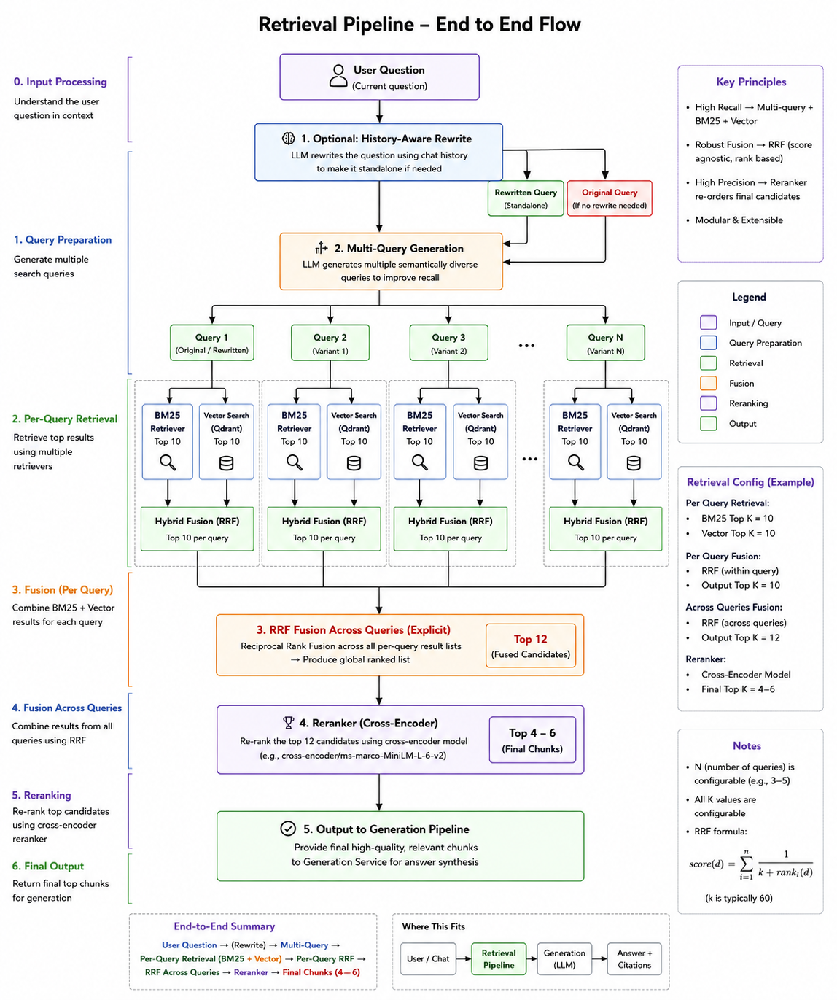

# 🧠 PaperMind

> Production-style Retrieval-Augmented Generation (RAG) system for research paper understanding and grounded question answering.

PaperMind helps users upload research papers and interact with them through contextual Q&A and cross-paper reasoning while keeping responses grounded in source evidence.

Instead of acting like a generic chatbot, PaperMind focuses on **retrieval quality, source grounding, and engineering clarity**.

---

## 🚀 Live Demo


🌐 **Landing Page:** [LANDING_PAGE_LINK](https://papermind-rag.vercel.app/)

🎥 **Backend API Demo Video:** Coming soon...

---

## 📌 Problem

Research papers are difficult to navigate:

- Long PDFs with dense information
- Important details scattered across sections
- Cross-paper comparison is tedious
- Generic LLMs often hallucinate

PaperMind addresses these issues by providing:

✅ Grounded question answering  
✅ Cross-paper reasoning  
✅ Source citations  
✅ Session-based retrieval isolation  
✅ Lightweight and fast interaction

---

## ✨ Features

### Document Understanding

- Upload multiple research papers
- Structure-aware PDF parsing
- Semantic chunk preservation

### Retrieval System

- Hybrid retrieval
- BM25 lexical search
- Vector similarity search
- Multi-query retrieval
- Reciprocal Rank Fusion (RRF)
- Reranking

### Grounded Generation

- Answer only from retrieved evidence
- Source citations
- Cross-paper comparisons
- Reduced hallucinations

### System Design

- Session-based architecture
- Temporary storage
- Async ingestion pipeline
- Retrieval isolation

---

## 🏗️ Architecture



---

## ⚙️ System Flow

```text
User Upload
    ↓
PDF Processing
    ↓
Unstructured Parsing
    ↓
Chunk Processing
    ↓
Embedding Generation
    ↓
Qdrant Vector Storage
    ↓
Retrieval Pipeline
    ↓
Grounded Answer Generation
    ↓
Answer + Citations
```

---

## 🔍 Retrieval Pipeline

PaperMind uses a multi-stage retrieval pipeline instead of simple vector search.

```text
User Query
    ↓
History-aware rewrite (optional)
    ↓
Multi-query generation
    ↓

For each query:

    BM25 Retrieval
    +
    Vector Retrieval

    ↓

Hybrid Fusion

↓

RRF across generated queries

↓

Reranker

↓

Top retrieved chunks

↓

LLM Answer Generation

↓

Grounded response with citations
```

---

## 📚 Example Workflow

```text
Create Session
    ↓
Upload Papers
    ↓
Start Ingestion
    ↓
Ask Questions
    ↓
Retrieve Evidence
    ↓
Generate Grounded Answers
    ↓
Return Citations
```

---

## 💬 Example Questions

PaperMind supports questions like:

### Single paper questions

- What is the main contribution of this paper?
- Explain the methodology in simple terms.
- What limitations are mentioned?
- Summarize the experimental setup.

### Cross-paper questions

- Compare the approaches used in both papers.
- Which paper performs better and why?
- What are the main differences in methodology?
- What assumptions do both papers make?

---

## 🧩 Tech Stack

### Backend

- FastAPI
- Pydantic
- LangChain

### Retrieval

- FastEmbed
- BM25
- Qdrant Cloud
- Reciprocal Rank Fusion (RRF)

### LLM

- Groq
- Llama models

### Document Processing

- Unstructured API

### Storage

- Supabase Storage

---

## 🎯 Engineering Decisions

### Why hybrid retrieval?

Vector search alone may miss:

- exact terminology
- acronyms
- equations
- paper-specific keywords

Combining lexical and semantic retrieval improves recall.

---

### Why avoid summarization during ingestion?

Avoiding ingestion-time summarization:

- reduces cost
- reduces latency
- avoids information loss
- avoids hallucination risk

---

### Why session-based retrieval?

Session isolation prevents:

- cross-document leakage
- irrelevant retrieval
- contamination between users

---

## 📄 API Example

### Ask Question

Request:

```json
POST /sessions/{session_id}/chat

{
    "question":"Compare both papers"
}
```

Response:

```json
{
  "answer":"...",
  "citations":[
      {
          "doc_name":"paper.pdf",
          "section_title":"Methodology",
          "page_start":4,
          "page_end":5
      }
  ]
}
```

---

## 🧠 Challenges Solved

During development:

- Preserving document structure
- Chunking long research papers
- Session-scoped retrieval
- Balancing recall and precision
- Reducing unnecessary LLM calls
- Keeping responses grounded

---

## 🔮 Future Improvements

Planned improvements:

- Observability stack
- Retrieval evaluation metrics
- Authentication
- Persistent user workspaces

---

## 📈 Project Goal

PaperMind is intentionally designed as a focused production-style system demonstrating:

- Retrieval-Augmented Generation
- Document intelligence
- Retrieval optimization
- FastAPI backend engineering
- Vector databases
- Grounded generation
- Session-based architecture

---

## 🤝 Connect

If you'd like to discuss:

- AI systems
- Retrieval engineering
- RAG pipelines
- backend architecture
- collaboration opportunities

Feel free to connect.

LinkedIn: www.linkedin.com/in/utkarsh-bodele

---

⭐ If you found the project interesting, consider starring the repository.