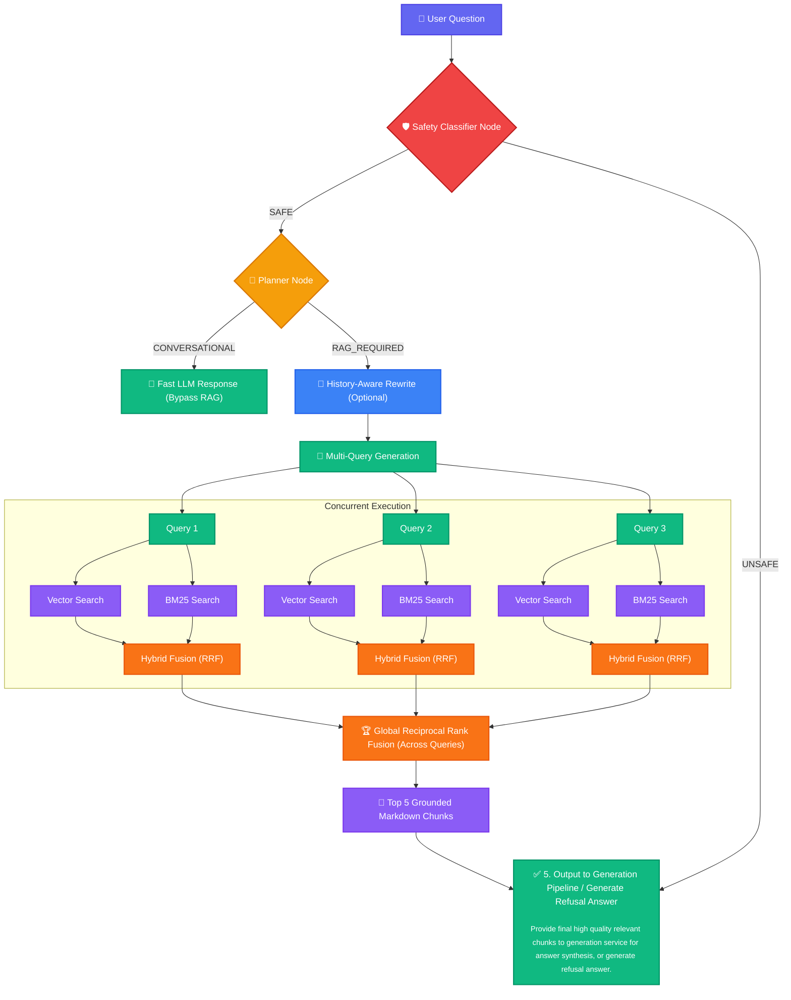

# 🧠 PaperMind

> Production-style Retrieval-Augmented Generation (RAG) system for research paper understanding and grounded question answering.

PaperMind helps users upload research papers and interact with them through contextual Q&A and cross-paper reasoning while keeping responses grounded in source evidence.

Instead of acting like a generic chatbot, PaperMind focuses on **retrieval quality, source grounding, and enterprise-grade engineering**.

---

## 🚀 Live Demo


🌐 **LIVE DEMO:** [Papermind Live Demo](https://papermind-rag.vercel.app/)

---

## 📌 Problem

Research papers are difficult to navigate:

- Long PDFs with dense information
- Important details scattered across sections
- Cross-paper comparison is tedious
- Generic LLMs often hallucinate

PaperMind addresses these issues by providing:

✅ Grounded question answering  
✅ Cross-paper reasoning  
✅ Source citations  
✅ Progressive Two-Tier PDF parsing for instant chat availability  
✅ Session-based retrieval isolation  
✅ Enterprise-grade safety and query routing

---

## ✨ Features

### Document Understanding (Two-Tier Ingestion)
- **Quick Pass:** Instantly extracts and embeds the first few pages using `fitz` (PyMuPDF) to unlock the chat UI in under 5 seconds.
- **Deep Pass:** Extracts high-fidelity Markdown (including perfect tables and semantic headers) in the background using `PyMuPDF4LLM`.
- **Semantic Chunking:** Uses LangChain's `MarkdownHeaderTextSplitter` to respect document boundaries instead of arbitrary character limits.

### Retrieval System
- Hybrid retrieval combining **BM25 lexical search** and **Vector similarity search**.
- Multi-query retrieval generation.
- Reciprocal Rank Fusion (RRF) for optimal context ranking.

### Smart Query Routing & Safety
- **Planner Node:** A lightweight LLM router classifying queries as Conversational vs. RAG-required, eliminating database load for casual chat and dropping latency by 2-3 seconds.
- **Safety Classifier (Guardrails):** A custom 70B LLM node evaluating intent (Toxicity, Jailbreaks, Politics) in under 1 second, guaranteeing deterministic refusal messages.

### Grounded Generation
- Answer only from retrieved evidence.
- Source citations mapped to original document sections and pages.
- Cross-paper comparisons.
- Reduced hallucinations.

### Evaluation & Observability
- **Ragas Evaluation Suite:** Automated pipeline evaluation yielding high accuracy (~95% Faithfulness, ~98% Answer Relevancy).
- **LangSmith & Logfire Integration:** Deep visual tracing of LLM calls, function execution latency, and context payloads.

---

## ⚙️ System Flow

```text
User Upload
    ↓
Progressive Two-Tier Parsing (Quick Pass & Deep Pass)
    ↓
Semantic Markdown Chunking
    ↓
Embedding Generation (FastEmbed)
    ↓
Qdrant Vector Storage
    ↓
Guardrails Safety Check (Classifier Node)
    ↓
Planner Node (RAG vs Conversational Routing)
    ↓
Retrieval Pipeline
    ↓
Grounded Answer Generation
    ↓
Answer + Citations
```

---

## 🔍 Retrieval Pipeline

PaperMind uses an advanced multi-stage retrieval pipeline instead of simple vector search. 
Here is the exact end-to-end flow when a user asks a question:



---

## 📚 Example Workflow

```text
Create Session
    ↓
Upload Papers (Instantly chat with Quick Pass)
    ↓
Deep Pass processes high-fidelity markdown in background
    ↓
Ask Questions
    ↓
Safety & Intent Routing
    ↓
Retrieve Evidence
    ↓
Generate Grounded Answers
    ↓
Return Citations
```

---

## 💬 Example Questions

PaperMind supports questions like:

### Single paper questions

- What is the main contribution of this paper?
- Explain the methodology in simple terms.
- What limitations are mentioned?
- Summarize the experimental setup.

### Cross-paper questions

- Compare the approaches used in both papers.
- Which paper performs better and why?
- What are the main differences in methodology?
- What assumptions do both papers make?

---

## 🧩 Tech Stack

### Frontend
- **Framework:** Next.js
- **State Management:** Zustand
- **Styling:** Tailwind CSS / Vanilla CSS

### Backend
- **Framework:** FastAPI
- **Validation:** Pydantic
- **Orchestration:** LangChain

### Retrieval & Storage
- **Vector Database:** Qdrant Cloud
- **Embeddings:** FastEmbed (BAAI/bge-small-en-v1.5)
- **Lexical Search:** BM25
- **Temporary Document Storage:** Supabase Storage

### LLMs & Parsing
- **Providers:** Groq (`llama-3.3-70b-versatile`, `llama-3.1-8b-instant`)
- **Document Processing:** PyMuPDF (`fitz`), PyMuPDF4LLM

### Observability & Evaluation
- **Tracing & Monitoring:** LangSmith, Pydantic Logfire
- **Automated Evaluation:** Ragas

---

## 🎯 Engineering Decisions

### Why Two-Tier Ingestion?
Waiting minutes for a large PDF to process ruins the user experience. By running a fast "Quick Pass" for immediate UI unlocking, followed by a "Deep Pass" background job that hot-swaps the vectors seamlessly, users experience zero downtime.

### Why hybrid retrieval?
Vector search alone may miss exact terminology, acronyms, equations, and paper-specific keywords. Combining lexical (BM25) and semantic retrieval ensures maximum recall.

### Why session-based retrieval?
Session isolation prevents cross-document leakage, irrelevant retrieval, and contamination between different users.

---

## 📄 API Example

### Ask Question

Request:

```json
POST /sessions/{session_id}/chat

{
    "question":"Compare both papers"
}
```

Response:

```json
{
  "answer":"...",
  "citations":[
      {
          "doc_name":"paper.pdf",
          "section_title":"Methodology",
          "page_start":4,
          "page_end":5
      }
  ]
}
```

---

## 🧠 Challenges Solved

During development:
- **Zero-Downtime Parsing:** Overcoming PDF processing bottlenecks with Progressive Two-Tier ingestion.
- **Latency Reduction:** Adding a Smart Planner Node to bypass expensive RAG lookups for casual conversational queries.
- **Strict Semantic Chunking:** Ditching arbitrary page chunking to preserve Markdown structures.

---

## 🔮 Future Improvements

Planned improvements:
- Authentication
- Persistent user workspaces
- Advanced Reranking Models
- Image & Multimodal reasoning

---

## 📈 Project Goal

PaperMind is intentionally designed as a focused production-style system demonstrating:

- Retrieval-Augmented Generation
- High-performance Document Intelligence
- Retrieval & Latency optimization
- FastAPI & Next.js full-stack engineering
- Vector databases
- Grounded generation
- Session-based architecture

---

## 🤝 Connect

If you'd like to discuss AI systems, RAG pipelines, or collaboration opportunities, feel free to connect!

LinkedIn: [Utkarsh Bodele](https://www.linkedin.com/in/utkarsh-bodele)

---

⭐ If you found the project interesting, consider starring the repository.